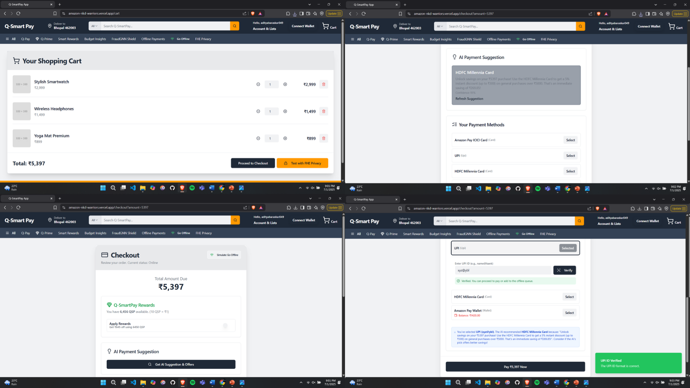
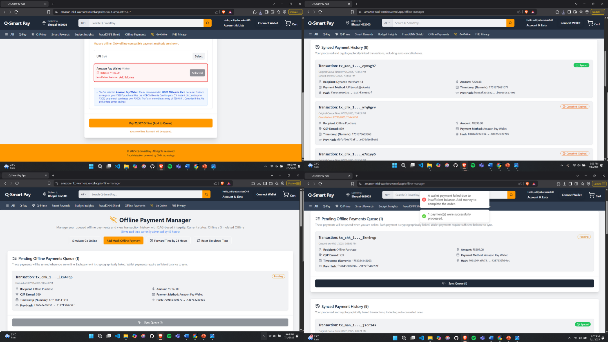
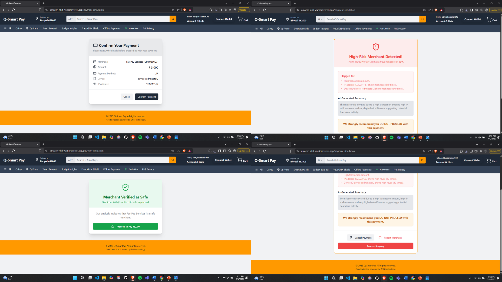
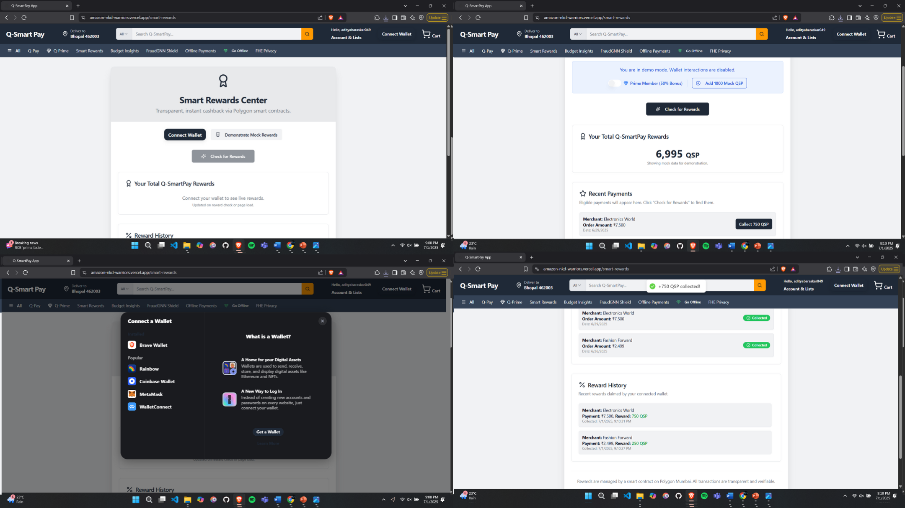

# 🔥 QSmartPay with Amazon 🔥

## Team Name: NKD Warriors

## Team Members:
- Anany Khare
- Anurag Sharma
- Aditya Baraskar

---

## 🎯 THEME: 
### Smart Payment Optimization

---

## 🧩 PROBLEM STATEMENT
Build an AI-powered solution that enhances any aspect of the payments ecosystem - from payment optimization and fraud detection to personalized rewards, budgeting or innovative payment experiences. The goal is to make payments smarter, more efficient and user-centric for individuals or businesses.

---

## 🚀 PROJECT OVERVIEW
Q-SmartPay is a forward-thinking prototype that reimagines the Amazon Pay experience by integrating cutting-edge technologies to deliver unparalleled security, privacy, intelligence and reliability.

Our platform is designed to seamlessly enhance the existing payment infrastructure with a suite of powerful features that protect users, offer smarter financial choices and ensure a smooth transaction process, even when offline.

---

## 📄 Presentation PDF
A presentation summarizing the QSmartPay architecture, feature flows and implementation highlights is included for quick reference. This PDF visually outlines the entire system and complements the live demo and README.

📄 File: [Presentation.pdf](./extra_bits/QSmartPay_Presentation.pdf)

---

## 🔗 Live Link

🚀 *Live Demo:* [Click here to view the live project](https://amazon-nkd-warriors.vercel.app/)

> This project was submitted as part of the Amazon HackOn 5.0 Hackathon under the "Smart Payment Optimization" problem statement.

---

## 🛠 Installation

To run the project locally, follow these steps:

```bash
# 1 ▪ Clone the repository
git clone https://github.com/adityabaraskar075/HackOn_NKD.git
cd HackOn_NKD

# 2 ▪ Create the environment file
cat > .env.local <<'EOF'
NEXT_PUBLIC_API_BASE_URL=https://your-api-endpoint.com
NEXT_PUBLIC_CLIENT_ID=your-client-id
NEXT_PUBLIC_SECRET_KEY=your-secret
EOF

# 3 ▪ Install dependencies
npm install

# 4 ▪ Build the project
npm run build

# 5 ▪ Start the development server
npm run dev    # Visit http://localhost:9002
```
---


## 🏠 Home Page UI

The QSmartPay homepage acts as the central dashboard for the user. It displays six key features, each represented as a clean, modern card-style button that navigates to a specific feature flow such as fraud detection, smart payment suggestions, offline manager, and more. The layout is minimalistic with TailwindCSS styling, quick-access navigation, and intuitive icons, ensuring a fast and responsive user experience.

📸 Screenshot:
 

---

## 💡 FEATURES
- Smart Payment Suggestion
- Offline Payments via DAG
- Budget Prediction using LSTM
- Scam/Fraud Detection using GNN
- Reward Validation using Smart Contract
- Privacy Preserving Computation using FHE

---

## 🌍 Real World Impact
Q-SmartPay empowers users with smarter, safer and more rewarding payment experiences through AI-driven suggestions, offline transaction support and real-time fraud alerts. It reduces friction at checkout, builds trust with instant rewards and protects user privacy. For platforms like Amazon Pay, it boosts engagement, lowers support overhead and enhances financial inclusion at scale.

---

## 🧪 Feature Details

Each feature of QSmartPay has been designed to solve real-world problems in digital payments while offering security, personalization, and accessibility. Below is a detailed explanation of each.

### 🧠 Smart Payment Suggestion

This feature leverages Genkit-based AI flows to intelligently suggest the optimal payment method during checkout. It considers the cart value, type of products, user preferences, historical payment data, and dynamic bank/card offers. For example, if a user is purchasing electronics worth ₹2,499, the system might recommend using an ICICI Amazon card to avail ₹250 cashback and an additional 10% discount.

By streamlining offer discovery and selection, this component improves user experience and encourages better financial decisions.

🔗 Explore: [/checkout](https://amazon-nkd-warriors.vercel.app/checkout)  
📸 Screenshot: 

---

### 🌐 Offline Payments via DAG

This feature enables transaction processing in environments with poor or no internet access. All offline transactions are stored locally and linked cryptographically in a Directed Acyclic Graph (DAG). When connectivity is restored, the system securely syncs and verifies these payments. Expired transactions (48h+) are auto-cancelled.

This ensures that users can continue to shop and pay regardless of connectivity, enhancing reach and reliability in underserved areas.

🔗 Explore: [/offline-manager](https://amazon-nkd-warriors.vercel.app/offline-manager)  
📸 Screenshot: 

---

### 📊 Budget Prediction

Using pattern recognition and past transaction data, our AI model predicts the user's estimated budget for the upcoming month. When users initiate a transaction, the system checks current category-wise expenditure and alerts if the budget is likely to be exceeded.

This allows for informed purchase decisions, promoting financial awareness and responsibility.

🔗 Explore: [/budget](https://amazon-nkd-warriors.vercel.app/budget)  
📸 Screenshot: 

---

### 🛡 Fraud Detection using GNN

This component introduces graph-based fraud detection using a simplified Graph Neural Network logic. It tracks the connections between user accounts, devices, merchants, and transaction history to identify suspicious behavior. If a UPI ID or payment method is flagged, the system issues a real-time warning.

It mimics fraud patterns that traditional rule-based engines miss, offering dynamic protection against financial scams.

🔗 Explore: [/payment-simulation](https://amazon-nkd-warriors.vercel.app/payment-simulation)  
📸 Screenshot: 

---

### 🎁 Reward Validation

Our blockchain-based reward system validates eligible transactions on-chain using a smart contract deployed on the Polygon testnet. When a user qualifies for a reward (e.g., QSP tokens for spending ₹5,000+), the contract is invoked to confirm eligibility and issue tokens securely and transparently.

This builds user trust in reward programs while showcasing decentralized automation.

🔗 Explore: [/smart-rewards](https://amazon-nkd-warriors.vercel.app/smart-rewards)  
📸 Screenshot: 

---

### 🔐 Privacy Preserving Computation

We leverage Fully Homomorphic Encryption (FHE) to process sensitive transaction data on the server without ever exposing the raw input. For instance, a user can check whether they’ve exceeded their spending cap without the system ever decrypting their actual spending values.

This ensures unmatched privacy for financial analytics, proving the feasibility of secure, server-side encrypted computation.

🔗 Explore: [/fhe-privacy](https://amazon-nkd-warriors.vercel.app/fhe-privacy)  
📸 Screenshot: 

---

## 🧰 Tech Stack 
- Next.js + TypeScript
- TailwindCSS
- REST APIs
- Python
- Flask
- Ethers.js + Solidity (Polygon Testnet)
- Genkit + AI Flows
- Fully Homomorphic Encryption (FHE)
- Graph Neural Network
- Directed Acyclic Graph

---

## 🧠 AI Models Used

QSmartPay leverages AI/ML in two primary domains to enhance security and personalization:

### 📌 Smart Offer Predictor ([GitHub Repo 🔗](https://github.com/adityabaraskar075/Smart_Offer_Prediction))
This model analyzes multiple contextual factors such as cart category, amount, user history and current promotional campaigns to recommend the most beneficial payment option. It mimics user behavior and learns optimal offer-card-product mappings using a decision tree-based classifier and scoring matrix. This model powers the real-time offer suggestion engine during checkout.

### 📌 GNN Fraud Detection ([GitHub Repo 🔗](https://github.com/adityabaraskar075/GNN_Fraud))
The fraud detection module is designed using a Graph Neural Network that constructs an entity-relationship graph between users, devices, IP addresses, UPI handles and merchants. It flags suspicious transactions based on node centrality, message-passing signals and prior scam node embeddings. It offers explainability via attention weights that help identify which connections contributed to the fraud alert.

These models ensure QSmartPay can deliver real-time, intelligent and secure suggestions tailored to each user.

---

## 🔮 Future Scope
- Voice-Enabled UX & Regional Language Support
- Web3 Wallet & BNPL Integration
- Goal-Based Budgeting
- Gamified Reward System
- Interoperability Across Platforms
- Global Expansion via Modular Compliance
- Decentralized Identity (DID) Integration
- Merchant-Side Dashboard

---

🎉 Proudly built for HackOn Amazon 5.0 by Team NKD Warriors
